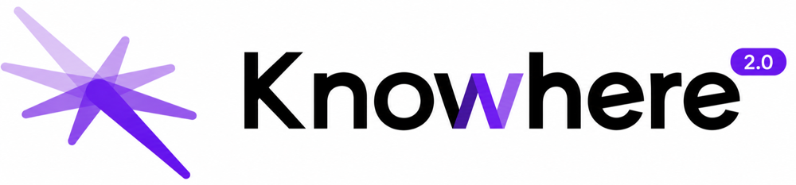
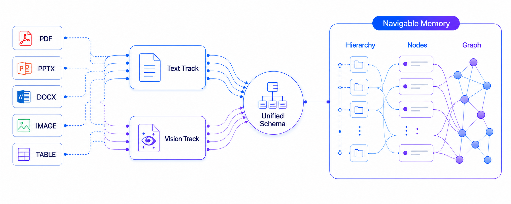
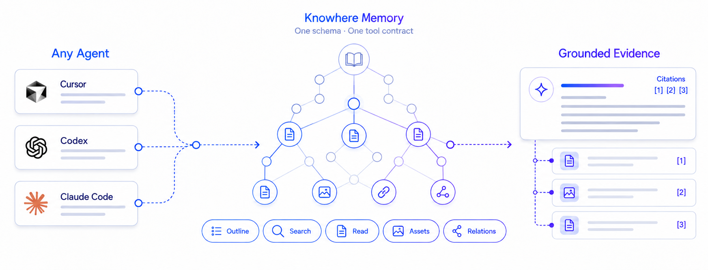
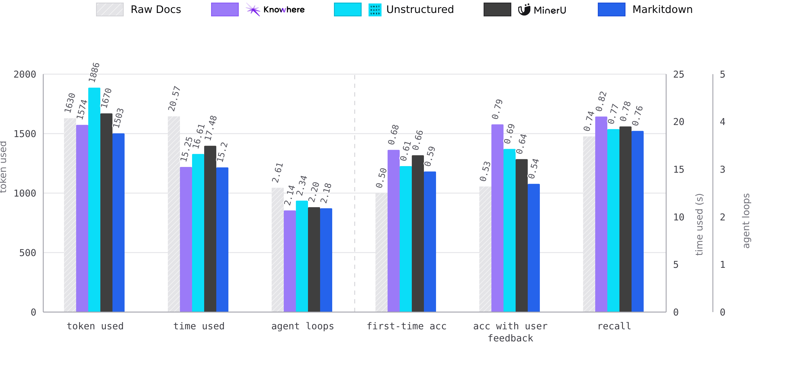

<h1 align="center">Prepare unstructured data for AI Agents</h1>

<p align="center">
  <a href="https://www.python.org/downloads/">
    
  </a>
  <a href="https://github.com/Ontos-AI/knowhere/stargazers">
    
  </a>
  <a href="https://github.com/Ontos-AI/knowhere/actions">
    
  </a>
  <br>
  <a href="https://github.com/Ontos-AI/knowhere/discussions">
    
  </a>
  <a href="https://ghcr.io/ontos-ai/knowhere">
    
  </a>
  <a href="https://github.com/Ontos-AI/knowhere/blob/main/LICENSE">
    
  </a>
</p>

<p align="center">
  🔗 <a href="https://knowhereto.ai">Website</a> |
  📄 <a href="https://docs.knowhereto.ai/">Docs</a> |
  🏠 <a href="https://github.com/Ontos-AI/knowhere-self-hosted">Self-Host</a> |
  🖥️ <a href="https://github.com/Ontos-AI/knowhere-dashboard">Dashboard</a>
</p>

## Overview

**Knowhere is a document parsing and retrieval system that turns complex, dirty files into persistent, navigable memory for AI agents—especially across local and offline document collections.**

It ingests unstructured documents and produces persistent, navigable memory: parsing, hierarchy reconstruction, multi-modal structuring, and graph construction in a single pipeline. Every result stays connected to its document, section, source pages, and related assets, making the output a natural fit for *Agentic RAG*, *vector-based RAG*, or any LLM workflow.

Knowhere 2.0 supports complementary **Vision and Text tracks**. Text-native documents retain precise extracted structure, while complex PDFs and PowerPoint files can be understood directly as pages by frontier vision models. Both tracks converge into the same memory schema, hierarchy, retrieval engine, and citation model.

> [!NOTE]
> **Get started in seconds with Knowhere Cloud.**
> Avoid the complexity of self-deployment. Use our managed API at [knowhereto.ai](https://knowhereto.ai) and enjoy **$5 in free credits** upon registration.

## 📢 News

- **September 8, 2026**: 🧭 **Introducing agent-native Retrieval 2.0.** MapNav has evolved from a fixed navigation workflow into a corpus-native foundation for agents. Knowhere provides a unified schema, hierarchy-aware tools, and resolvable evidence references; the agent decides how to search, traverse, read, and cite. The same foundation powers built-in retrieval and external agents through MCP.
- **September 2026**: 👁️ **Introducing dual-track Document Parsing 2.0.** Vision Page and Text Track now converge into one hierarchy-native memory schema for retrieval, understanding, and citation.
- **June 1, 2026**: 📚 **Knowhere now supports ultra-long PDFs and atlas-style documents.** The parsing pipeline can process long-form PDFs with hundreds of pages (for example, 300, 500, or more) and route technical atlases or drawing collections through a dedicated layout-aware parser.
- **May 7, 2026**: 🚀 **Knowhere is now Open Source!** We have open-sourced our entire stack for document ingestion, parsing, and agentic RAG. You can now self-host the full platform using [knowhere-self-hosted](https://github.com/Ontos-AI/knowhere-self-hosted). Check out our [Contribution Guide](CONTRIBUTING.md) to get involved!

## Vision + Text: Document Parsing 2.0

Traditional OCR and Document Intelligence pipelines try to extract every element before a model can understand the document. On dirty PDFs and slide decks, mistakes in reading order, layout, tables, or hidden text layers can accumulate into unreliable model context.

Knowhere does not make perfect element-by-element extraction a prerequisite for retrieval. The Text Track preserves precise text and native structure where they are reliable. The Vision Track uses frontier vision models to understand a page or slide as a whole, so visually complex content can still be recalled and understood without first reconstructing every element.

<p align="center">
  
</p>

- **Two tracks, one contract**: Both parsing paths produce the same chunk and metadata schema, so downstream storage, hierarchy, graph construction, and retrieval remain format-independent.
- **Recall without brittle reconstruction**: Pages can be indexed through summaries, entities, source text, and hierarchy even when OCR or layout extraction cannot reliably recover every component.
- **One navigable memory**: Text sections and vision-understood pages become compatible hierarchy nodes with source evidence, linked assets, and cross-document relationships.

PDF and `.pptx` uploads through the V2 Jobs API use the Vision Track; other supported formats use the Text Track. The tracks differ in how they understand the source, not in how agents consume the resulting memory.

## How it Works

Knowhere runs in two steps: build memory from documents, then let agents retrieve from it.

### Step 1: Parse and Build Memory

- **Route**: Select the Vision or Text track according to the document format and API generation.
- **Understand**: Preserve native text structure where it is reliable, or understand complex pages holistically with a vision model.
- **Normalize**: Convert both tracks into the same hierarchy-native chunk and metadata schema.
- **Build Memory**: Store navigation trees, linked assets, citations, and cross-document relationships as agent-ready context.

### Step 2: Agentic Retrieval

Knowhere provides the document-memory substrate; the agent decides how to explore it.

<p align="center">
  
</p>

- **Provide the substrate**: Knowhere exposes one corpus schema and tools for document outlines, structural filters, exact search, fuzzy recall, full reading, assets, and cross-document relationships.
- **Let the agent explore**: Instead of forcing every query through a fixed navigation pipeline, the agent chooses which tools to call, in what order, and how deeply to traverse.
- **Stay agent-neutral**: The same corpus and evidence contract works across built-in agents, MCP clients, models, and orchestration frameworks. Whichever agent explores the memory, Knowhere resolves its references into traceable documents, sections, pages, and linked assets.

## FAQ

**Q: What is Knowhere's relationship with MinerU?**

A: MinerU remains the default raw PDF extractor for Knowhere's V1 chunk-based pipeline. PDF and PowerPoint uploads through the V2 API use Vision Page instead: Knowhere renders the source pages, combines their visual interpretation with document profiling and TOC structure, and assembles page-grounded hierarchy nodes. MinerU is still useful, but V2 no longer treats parser-generated Markdown as the only source of truth.

**Q: What LLM / VLM dependencies does Knowhere have?**

A: We recommend [`deepseek-v4-flash-vision-exp`](https://api-docs.deepseek.com/guides/vision/) as a unified model for both Text and Vision workloads. It accepts text and image input, so the same model can handle summarization, hierarchy reasoning, page understanding, and asset descriptions. The model is currently experimental, and Knowhere remains model-agnostic: you can use another model—or separate Text and Vision models—from OpenAI, Qwen, GLM, Volcengine, or any compatible provider.

**Q: How is Agentic Retrieval different from traditional RAG?**

A: Traditional RAG does a flat vector lookup and returns isolated snippets. Knowhere's agents navigate the document's section tree and cross-document graph, drilling into the most relevant regions the way a human reader would, returning traceable, well-contextualized evidence.

**Q: Does it handle images and tables?**

A: Yes. Knowhere extracts images and tables, runs them through VLM-assisted summarization and feature extraction, and links them back to their source section nodes. Vision Page also retains rendered page citations, so agents can return both structured context and the visual source evidence.

## Performance Benchmark

Agents using Knowhere outperform those working from raw documents, Markitdown, Unstructured, or MinerU output on real-world tasks: searching, modifying, and answering questions.

<p align="center">
  
</p>

> **We're not developing the next MinerU — we're building document memory infrastructure that agents can effectively consume.**

### Key Advantages

- **Accuracy**: +36% first-try accuracy and +11% recall over raw documents.
- **Reliability**: 79% accuracy with feedback, vs. a ~53% ceiling on raw docs.
- **Efficiency**: Fewer loops, fewer tokens, less time. Agents navigate a structured graph instead of reading monolithic text.

*(Internal evaluation across identical agentic RAG tasks. Baselines: raw documents and parser output fed directly to agents.)*

> [!NOTE]
> **📊 Benchmarks are actively expanding.** More parsers and retrieval baselines coming soon.

## Ecosystem

| Repository | Description |
|---|---|
| [knowhere](https://github.com/Ontos-AI/knowhere) | **This repo.** Backend API and worker: document ingestion, parsing, graph construction, and retrieval. |
| 🖥️ [knowhere-dashboard](https://github.com/Ontos-AI/knowhere-dashboard) | The web UI. Connects to the API for the full product experience. |
| 🐳 [knowhere-self-hosted](https://github.com/Ontos-AI/knowhere-self-hosted) | Docker Compose stack for self-hosted deployments. Packages the API, worker, and dashboard together. |
| 🐍 [knowhere-python-sdk](https://github.com/Ontos-AI/knowhere-python-sdk) | Official Python SDK for the Knowhere Cloud API. |
| 🦕 [knowhere-node-sdk](https://github.com/Ontos-AI/knowhere-node-sdk) | Official Node.js SDK for the Knowhere Cloud API. |

## Features

- **Dual-track Parsing**: Vision and Text tracks handle different document conditions while producing the same downstream schema.
- **Vision Page Understanding**: Frontier vision models make complex PDF and PowerPoint content recallable without requiring perfect element-by-element OCR or layout reconstruction.
- **Hierarchy-native Memory**: Section nodes preserve document paths, page ranges, summaries, entities, and linked assets instead of returning disconnected chunks.
- **Cross-document Memory Graph**: Page-derived typed entities and keywords connect related documents across a namespace.
- **Agent-native Retrieval**: Built-in and MCP-connected agents explore the same corpus schema and hierarchy-aware tools; classic retrieval remains available for deterministic top-K search.
- **Page-grounded Citations**: Results retain source documents, section paths, page numbers, and rendered visual evidence.

## Supported Formats

**✅ Supported**

- [x] `.pdf` `.pptx` — Vision Page through the V2 Jobs API
- [x] `.doc` `.docx` `.xls` `.xlsx`
- [x] `.jpg` `.jpeg` `.png`
- [x] `.md` `.txt` `.html` `.htm` `.json`

**⏳ Coming Soon**

- [ ] `.epub` `.xml`
- [ ] `.mp4` `.mp3`
- [ ] `.skills.md`

Want to see a new format supported? Adding a parser is a great first contribution. Check out [CONTRIBUTING.md](CONTRIBUTING.md) to get started.

## Prerequisites

- Python 3.11+
- `uv`
- Docker with `docker compose`

## Quick Start

1. Sync the workspace dependencies:

```bash
uv sync --all-packages
```

2. Copy the environment examples:

```bash
cp apps/api/.env.example apps/api/.env
cp apps/worker/.env.example apps/worker/.env
```

3. Update the copied `.env` files with the values you need for local work:

- database and Redis connection settings
- S3-compatible storage credentials
- at least one LLM provider key: `DS_KEY`, `ALI_API_KEYS`, `GPT_API_KEY`, or `GLM_API_KEY`
- a vision-capable model provider for V2 PDF/PowerPoint parsing, page understanding, image summaries, OCR, atlas classification, or image-aware retrieval
- `MINERU_API_KEYS` only if you use the V1 chunk-based PDF/PowerPoint pipeline
- any optional billing or webhook providers you want to enable

Most parser and retrieval tuning values have code defaults. Start with the
required external services first, then override model names, provider URLs,
budgets, or concurrency limits only when your deployment needs different
behavior. See [docs/external-services.md](docs/external-services.md) for the
full dependency matrix.

4. Start the local infrastructure stack:

```bash
./deploy/local-dev/start-dev.sh
```

5. Start the API and worker in separate terminals:

```bash
cd apps/api && uv run main.py
cd apps/worker && uv run worker.py
```

Run API migrations explicitly before starting the API when the database schema needs updating:

```bash
cd apps/api
uv run alembic upgrade heads
```

For API-only development without the dashboard, create an API-only user/key
after the API service starts:

```bash
cd apps/api
uv run scripts/init_user.py --email you@example.com
```

If you plan to use the dashboard, register through the dashboard instead of
using `scripts/init_user.py`.

The API is now running at `http://localhost:5005`. If you want the full product experience with a UI, run the [knowhere-dashboard](https://github.com/Ontos-AI/knowhere-dashboard) alongside it; it connects to this API out of the box.

## Quality Checks

Run lint checks from the repository root:

```bash
make lint
```

Apply safe Ruff fixes:

```bash
make lint-fix
```

Run type checks across the API, worker, and shared source code:

```bash
make typecheck
```

Run both lint and type checks:

```bash
make check
```

## Local Endpoints

- API: `http://localhost:5005`
- OpenAPI docs: `http://localhost:5005/docs`
- LocalStack: `http://localhost:4566`
- PostgreSQL: `localhost:5432`
- Redis: `localhost:6379`

## Additional Guides

- Retrieval document scope:
  [docs/retrieval-document-scope.md](docs/retrieval-document-scope.md)
- External dependency guide:
  [docs/external-services.md](docs/external-services.md)
- Architecture decisions:
  [docs/adr/README.md](docs/adr/README.md)

## Telemetry

Self-hosted Knowhere emits **anonymous** product telemetry to PostHog so Ontos
operators can understand OSS adoption (install liveness, usage aggregates,
client/document mix). Events never include filenames, prompts, emails, IPs, or
geo. Schema and allowlists are locked in
[ADR-0004](docs/adr/0004-anonymous-self-hosted-telemetry.md).

Telemetry is **default-on**. To opt out, set:

```bash
TELEMETRY_ENABLED=false
```

Related settings live in `apps/api/.env.example` under `TELEMETRY_*`.

## Citation

If you use Knowhere in your research, please cite it as:

```bibtex
@software{knowhere2026,
  author       = {Ontos AI},
  title        = {Knowhere: Prepare Unstructured Data for AI Agents},
  year         = {2026},
  publisher    = {GitHub},
  url          = {https://github.com/Ontos-AI/knowhere},
  version      = {2026.04.30.1},
  license      = {Apache-2.0}
}
```

## Communication

- [GitHub Discussions](https://github.com/Ontos-AI/knowhere/discussions) for questions, ideas, and general conversation.
- [GitHub Issues](https://github.com/Ontos-AI/knowhere/issues) for bug reports and feature requests.

## Contribution

Any contributions to Knowhere are more than welcome!

If you are new to the project, check out the [good first issues](https://github.com/Ontos-AI/knowhere/issues?q=is%3Aissue+is%3Aopen+label%3A%22good+first+issue%22). They are well-defined, relatively simple, and a great way to get familiar with the codebase and the contribution workflow.

For general guidelines on branching, commit conventions, and the review process, take a look at [CONTRIBUTING.md](CONTRIBUTING.md).

Other useful references:

- [SECURITY.md](SECURITY.md): how to report vulnerabilities responsibly.
- [CODE_OF_CONDUCT.md](CODE_OF_CONDUCT.md): community behavior expectations.
- [LICENSE](LICENSE) and [NOTICE](NOTICE): Apache 2.0.

## 👋 We're Hiring!

We're building the knowledge layer for the Agent era. If that sounds like work you want to do, reach out. Decode the address below and drop us a line:

```bash
echo 'dGVhbUBrbm93aGVyZXRvLmFp' | base64 --decode
```
