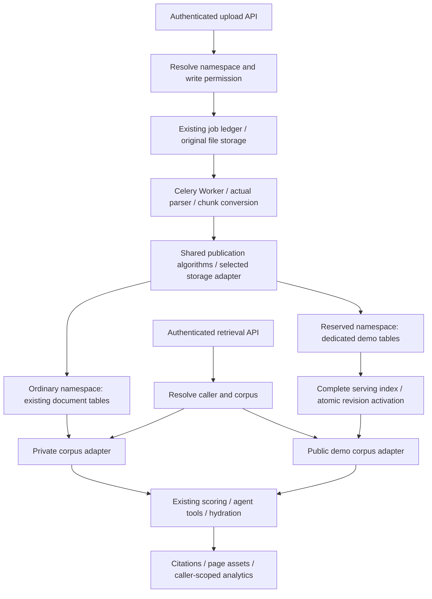

# Dedicated demo corpus tables

Status: implemented and deployed; recovery snapshot recorded on 2026-10-05.
This document records the selected design and the deployed implementation. The
production recovery completed with 27/27 demo sources READY, 2,562 published
chunks, and shared generation 27. The operator evidence is retained locally in
the ignored `.demo-originals/production-restoration-20261005/` directory.

## Decision

Keep one PostgreSQL database. Persist the public demo corpus in dedicated tables.
The existing upload API accepts a reserved demo namespace from an authorized
maintainer, and the existing Worker parses and publishes the result into these
tables. Any authenticated user can query the reserved namespace. Publication
occurs once per demo version, with no per-user content materialization.

The delivered system supports direct queries against the public demo namespace.
Private namespace queries keep their existing corpus. The previous proposal to
create user-owned document references is superseded; clients query private and
demo namespaces separately and merge results when they need both.

## End-to-end flow

The API decides the corpus before enqueuing a task. It records a trusted
publication target with the job. Worker retries use that persisted decision;
they cannot reclassify a job using caller-controlled parser metadata.

## Routing and permissions

The reserved namespace is fixed as `__knowhere_demo__`. Confirm it
does not collide with an existing private namespace before activation.

| Request | Authorization | Storage |
| --- | --- | --- |
| Ordinary upload/query | Existing caller ownership | Existing tables |
| Demo upload/update/archive | Explicit maintainer permission | Demo tables |
| Demo query/list/read/assets | Authenticated catalog read access | READY demo revisions |

All users can read available demo documents. Publication permission remains
restricted to maintainers, avoiding arbitrary uploads into the shared corpus.
Validate the namespace and privilege at API ingestion and Worker publication.
Do not accept a request field such as `is_admin` as authorization.

Keep authenticated caller identity separate from corpus identity. Billing,
rate limits, retrieval runs, traces, cache entries, and personal hit statistics
belong to the caller even when content comes from demo tables. Never replace
the caller with the uploader or a system owner throughout the retrieval context.

API and Worker use non-superuser runtime roles without BYPASSRLS. Authorized
demo writes set a server-controlled, transaction-local maintainer context;
FORCE RLS denies content writes without that context. Schema migrations use a
separate management connection. No separate demo-only writer credentials are
required. Validate policies using the actual runtime roles.

## Implemented table families

Use separate physical tables for content and its derived serving structures.
Retain the current shapes where feasible to reuse algorithms and contracts.

| Tables | Responsibility |
| --- | --- |
| `demo_documents` | Stable source ID, display title, status, current published revision |
| `demo_document_sections`, `demo_document_chunks` | Versioned hierarchy, body, search fields, metadata, asset references |
| `demo_document_map_units`, `demo_document_map_unit_tokens` | Exact path/content units and token frequencies |
| `demo_document_map_unit_indexes` | Completeness marker and existing BM25 revision statistics |
| `demo_retrieval_serving_revision_manifests` | Immutable navigation/chunk manifest per revision |
| `demo_retrieval_namespace_generations`, `demo_retrieval_namespace_map_snapshots` | Coherent shared corpus generation and navigation snapshot |
| `demo_graph_nodes`, `demo_graph_edges` | Shared document graph consumed by agent tools |
| `demo_retrieval_hit_stats` | Caller-scoped hit records with a demo document foreign key |

Jobs, job state history, job results, retrieval runs, and retrieval steps remain
the permanent processing/analytics ledger in their existing tables. Assets remain
in existing object storage, versioned per demo revision and shared by all readers.

The existing `job_results.document_id` foreign key targets ordinary `documents`.
Add a nullable `demo_document_id` foreign key to `demo_documents` and a constraint
preventing both document references from being set. A result can initially have
neither reference during processing. Publication binds the appropriate reference;
replay/idempotency checks must recognize both. Never put a demo ID into the
existing ordinary-document foreign key or silently drop referential integrity.

The existing hit-stat foreign key has the same ordinary-document restriction,
hence the dedicated demo hit table above. Retrieval-run final IDs are stored with
explicit corpus provenance. Document IDs must be distinguishable and resolve only
within the server-authorized corpus, including saved citations and asset requests.

Demo token indexes serve the same query predicates as the existing reader.
Start with the required primary/uniqueness, token-leading lookup, and unit lookup
indexes. Do not copy historical redundant indexes. New migrations are additive
and idempotent; existing migrations remain unchanged.

## Publication module and storage adapters

Introduce a typed corpus target resolved by the server: PRIVATE or DEMO. Its
interface describes authorization, publication/read operations, revision identity,
and completeness. Two storage adapters select the correct models/tables.

Reuse parser routing, chunk conversion, section construction, lexical preparation,
score-unit generation, token frequencies, statistics, manifest construction, and
graph algorithms. Hide table selection in repositories/adapters. Existing raw SQL
must be compiled from allowlisted table definitions; never substitute a user
namespace into SQL identifiers or apply global string replacements.

The actual integration points include the API ingestion target, shared job
lifecycle publication, publication content/map-unit/manifest writers, retrieval
context, and every corpus reader. This is a persistence and authorization change,
not a fork of the parsing or scoring implementation.

## Complete lifecycle

1. A maintainer uploads a demo with the reserved namespace through the real API.
2. The API creates the ordinary processing job, stores the original, and enqueues
   the same Celery task with its authorized corpus target.
3. Worker executes the selected parser and converts the real parse output.
4. Demo publication writes sections/chunks/map units/tokens/statistics/manifest
   for a new immutable revision. Failed publication rolls back and follows the
   existing job retry policy.
5. Activate the revision, update graph/snapshot/generation, and commit atomically.
   Readers never observe a document with an incomplete token index.
6. Listing/catalog readiness comes from the published database state. Queries
   use the completed demo revision without copying it into a user's namespace.

Use a stable source key for update/re-upload idempotency. A new version replaces
the active pointer only after successful publication. Existing requests capture
revision pins/generation; they retry under the current consistency policy rather
than mixing old and new content. Saved citations identify their source revision,
which remains available under the read policy.

Maintainer archive removes a demo from future public discovery and advances the
shared generation. User archive requests cannot archive shared demo documents.
Define retention for old revisions before adding cleanup; retain them initially.
Deleting a processing job/result must not cascade-delete published demo content
that readers or saved citations still reference; protect published ledger rows or
detach archival ledger references through a controlled lifecycle operation.

## Retrieval compatibility

Corpus resolution occurs once at the request entrance. Carry it through classic
BM25 discovery, map lighting, small-corpus reads, hydration, connected chunks,
document/section filters, and revision pins.

Default agent retrieval must use the same target for list, recall, grep, read,
outline, neighbors, and final reference resolution. Document/chunk/page-citation
and asset endpoints also resolve it; supporting only the ranking query would
leave results that cannot be opened.

Keep token strings/frequencies, channel lengths, average-IDF combination, query
document frequencies, type filtering, RRF, ordering, and public result shapes.
Statistics are calculated over the selected demo query corpus. Cache keys include
caller, corpus target, shared generation, query, and filters; private/demo entries
cannot collide. No background indexing after a successful publication response.

## Demo recovery and migration

The production recovery re-uploaded all 27 original demo files through the v2
jobs API and the normal Worker path, including SpaceX. Stable catalog source IDs
and canonical document IDs were preserved. Parsing can change chunk boundaries;
old static chunk IDs are not promised after a reparse. Historical revisions and
assets remain available for revision-pinned reads.

SpaceX has 407 physical pages and 388 indexed pages. The missing introductory
pages are a page-memory hierarchy/TOC scope limitation in the parser and are
tracked separately from the dedicated-table publication work.

For publication parity checks, publish the same captured ParseOutput through both
adapters. This distinguishes persistence/scoring drift from model nondeterminism
between two fresh parses. Separately exercise actual parsing end to end.

The production catalog is now published and usable from the dedicated tables.
Parsing time remains separate from user query and read latency; no ten-second
full-parsing promise is made.

## Rollout and rollback

The shared namespace is enabled directly; there is no demo feature flag and no
second publication strategy. Authorized maintainers restore sources through the
existing v2 jobs API and the production parser/Worker. The old materialization
endpoint returns 410, while existing personal copies continue to use ordinary
private tables.

Rollback restores the previous compatible API and Worker images together after
stopping new demo imports. Keep the additive tables, original backups, and
revision assets in place; do not run a destructive down migration. Demo reads
may remain unavailable during rollback. Re-enable imports only after the
compatible pair is running.

## Performance and historical implementation estimate

Shared demo content is published once. User access writes no copied chunks or
tokens, eliminating the previous per-user materialization workload entirely.
Separate B-trees avoid maintaining the personal token indexes when publishing
new demos. Both families still share PostgreSQL CPU, memory, WAL, and storage I/O;
table separation is not resource isolation.

The earlier SpaceX materialization had 227 chunks/units and 10,778 token rows per
user. These no longer grow with the number of demo readers. Query load, personal
hit statistics, and the number/size of maintained demo versions still grow.

The ten-second publication target no longer applies to every user viewing a demo:
that synchronous materialization operation is removed. Actual query latency still
depends on corpus size and agent/model calls. Initial PDF parsing/publication may
take much longer than ten seconds; this design does not promise otherwise.

| Work | Estimate |
| --- | ---: |
| Additive schema, foreign keys, corpus adapters and permissions | 2-3 engineering days |
| API/Worker ingestion and complete demo publication | 2-3 days |
| All retrieval tools, document/asset reads, catalog and cache routing | 2-3 days |
| Focused verification, reimport pilot and rollout/rollback handling | 1-3 days |

Total estimate: **7-12 engineering days**, plus full catalog parsing/deployment
elapsed time. Main risk is missing a read/write/foreign-key path, not inventing a
new ranking algorithm. Stage the implementation around a real API -> Worker ->
parser -> demo publication -> retrieval vertical slice first.

## Verification and follow-up

The deployed backend was checked with focused contract coverage for private/demo
routing, unauthorized public writes, foreign keys, retries, publication atomicity,
readiness, filters, revision pins, classic/agent tools, graph, assets, cache
isolation, and rollback behavior. Runtime checks used the non-bypassing database
role rather than only a privileged test connection.

Real HTTP validation covered SpaceX and the other restored sources through API,
Celery, parser, publication, query, document/chunk reads, originals, assets, and
page-citation sources. Multiple readers did not create new demo jobs, chunks,
tokens, or asset uploads.

Notebook/client migration is still required before the complete user-facing Add
Demo workflow is accepted. Until that migration lands, clients must use the
shared catalog/document/revision contract directly.
