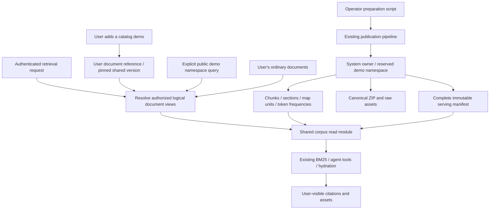

# Shared read-only demo namespace

> **Historical proposal — superseded.** The current implementation is documented
> in [Dedicated demo tables](dedicated-demo-tables.md) and
> [Shared demo rollout](../shared-demo-rollout.md). It uses dedicated demo
> tables, direct reads from `__knowhere_demo__`, and the real API/Worker
> ingestion path. It does not create per-user demo materializations.

Status: superseded design, 2026-10-03. The sections below are retained as design
history and are not an implementation or operations contract. In particular,
their materialization tables, fallback behavior, shared-namespace feature flag,
and rollback conversion flow are not part of the current system. The
production recovery snapshot on 2026-10-05 recorded 27/27 READY sources in the
dedicated demo tables.

## 1. Decision and scope

Store each published demo version once under an internal system owner in a
reserved namespace, provisionally `__knowhere_demo__`. An operator script
publishes new sources and versions. Authenticated users can retrieve catalog
sources from this namespace but cannot upload, replace, archive, or publish
content into it.

For the existing Add Demo workflow, adding a demo to a personal namespace creates
a small user-owned document reference. Its chunks, sections, map units, token
frequencies, serving manifest, and assets are read from the shared version.
Ordinary uploaded documents retain their existing publication path.

This requires an explicit shared-corpus read policy. A namespace name by itself
does not grant cross-user access: current queries also restrict `user_id`.
Namespaces for ordinary documents remain caller-owned isolation labels.

## 2. Evidence and expected benefit

The recorded October 1 production SpaceX request took 25.599 seconds over HTTP.
Its sections/chunks/map-index stage took 22.506 seconds and bundle reuse took
1.649 seconds. It wrote 227 chunks, 227 map units, and 10,778 token-frequency
rows. These are historical observations, not a fresh deployment inspection.

The database mechanics experiment reproduced substantial token-index page reads
on a large clone. It did not isolate every part of the production request.
The historical database-mechanics notes remain an unpublished local draft.

The shared namespace removes these per-user writes entirely, rather than making
the same COPY operations faster. Publication still happens once when an operator
prepares a source. That operation may take more than ten seconds and is outside
the user Add Demo request.

| Operation | Current materialization | Proposed materialization |
| --- | --- | --- |
| Result ZIP/raw assets | Existing canonical reuse | Reuse prepared version |
| Sections/chunks/search text | Copy for each user | Read shared rows |
| Map units/token index | Build for each user | Read shared rows |
| Serving manifest | Build for each user | Read shared manifest |
| User state | Job, result, document, claim | Lightweight job, result, document, claim, binding |
| Namespace update | Publish full document manifest | Record reference and advance generation |

With 10,000 references to SpaceX, the existing pattern would add approximately
107.78 million token rows and 2.27 million chunk rows. The shared version keeps
10,778 token rows and 227 chunk rows, plus small reference records. Personal
uploads, reference listings, request concurrency, and retrieval output still grow
with use; this does not make the whole application independent of data volume.

## 3. Architecture

The same scoring and token storage are used for personal and shared physical
documents. The new module resolves which physical revision backs each authorized
logical document and projects reads into that logical document's identity.
No external search service or new tokenizer is needed.

## 4. Data model

Reuse existing document/publication tables for the shared physical corpus. Add
two small tables rather than creating a parallel token-index schema.

| Record | Proposed fields and responsibility |
| --- | --- |
| `demo_source_versions` | `version_id`, `demo_source_id`, source digest, lexical/compiler fingerprint, physical document ID and job-result ID, manifest digest, counts, preparation state, timestamps |
| `document_demo_bindings` | User document ID and user job-result ID, pinned demo version ID, view-format version; unique user document revision |
| `documents` | Existing user-owned shell for a mounted demo; ordinary ownership, namespace, status, title, and current job-result fields |
| `demo_materializations` | Existing per-user/namespace/source claim and idempotency record; points to the user shell |
| Existing shared publication rows | System-owned job/result/document, sections, chunks, map-unit marker and tokens, graph, manifest, canonical asset pointers |

Use foreign keys to enforce document/revision relationships and `RESTRICT` deletion
of a referenced shared version. A binding must refer to the shell's document
revision, not merely to an arbitrary job-result ID. Add composite uniqueness/FKs
where necessary for that invariant. Index bindings by user document revision and
shared version for reads and rollback inventory.

The shared corpus owner is an internal principal that cannot authenticate using
normal user credentials. The reserved namespace is a configured internal scope,
not a new public namespace-management resource.

Use one physical document per source version. The catalog chooses the version
available for new references; existing references remain pinned to their version.
Retained old versions do not enter public searches unless explicitly selected by
the server's catalog policy. Never discover the shared corpus by selecting all
documents belonging to the system owner.

Keep lightweight user jobs/results initially to preserve the processing ledger
and existing response fields. Their result pointers reference the canonical
artifacts; they contain no duplicate parsed content. Their publication kind is
explicitly a shared reference, so index readiness does not require a nonexistent
local token index. Client-supplied metadata cannot select this kind.

## 5. Access and authorization

### Direct shared namespace queries

An authenticated query for the reserved namespace resolves only catalog-approved
READY source versions. By default it can search all currently available demos;
an explicit source/document selection can narrow that set. This satisfies access
for all users without requiring them to copy or mount the corpus first.

The authenticated caller remains the identity used for rate limits, billing,
retrieval analytics, caching, and permission checks. A separate resolved read
scope contains the system-owned physical rows. Do not impersonate the system
owner by replacing the request's `user_id` throughout execution.

### Personal namespace queries

Resolve the union of ordinary user-owned documents and active demo references in
the requested personal namespace. Include only demos that the user added there;
do not silently append the whole public catalog to every private query.

A reference is authorized by its user-owned shell. Exclusions, document filters,
revision pins, section filters, and archive state operate on that logical identity.
Two users referencing the same demo share content, not personal documents,
retrieval history, or archive state.

### Write protection

Reject the reserved namespace at all user write entry points, including uploads,
remote ingestion, retry/reprocess operations, demo materialization targets, and
any update/move operations. Enforce the same rule again in shared publication
before writes, so a queued Worker task cannot bypass an API guard.

Only an explicit operator preparation context may publish into the system corpus.
Do not grant this privilege from job metadata, request fields, or model tool
arguments. Operator preparation uses a separate database write role; runtime
roles cannot modify READY shared source data. Apply database privileges/RLS to
the system rows as part of delivery. Verify policies using the runtime role;
table-owner bypass must not undermine protection.

Original files, chunks, page citations, and assets use the same catalog read
policy. A guessed document/asset ID must not unlock another system-owned corpus.

## 6. Operator preparation and versioning

Provide an idempotent operator command with dry-run, prepare, inspect, and activate
operations. Exact CLI names are to be chosen during implementation. Preserve the
existing bundle preparation command and reuse its versioned storage outputs.

1. Load and validate a catalog source; calculate source and preparation digests.
2. Acquire a build lock for that exact source/version, not the whole namespace.
3. Prepare/reuse canonical ZIP and raw assets outside the publication transaction.
4. Publish through the existing complete publication pipeline under the system
   owner: sections, chunks, map index, graph, serving manifest, and statistics.
5. Validate counts, integrity, asset references, exact frequencies, and manifest.
6. Commit the complete source version as READY. Failed publication rolls back;
   retry can reuse already prepared immutable storage objects.
7. Activate the READY version in the catalog in a short transaction, advancing
   the shared serving generation. Report version, digest, counts, and outcome.

Readiness is a database fact; a Redis entry or an S3 ZIP alone is insufficient.
Preparation states are BUILDING, READY, and FAILED. Catalog availability is a
separate pointer/policy, so withdrawing a source from new selection does not
mutate READY content or invalidate existing references unexpectedly.

The fingerprint includes projected title/path, ordered chunk content and relevant
metadata, section summaries, normalization/deduplication, provider/root-asset
ownership, score-unit construction, tokenizer implementation/dictionary/config,
and index format. Use deterministic structured serialization. Random user IDs,
timestamps, and job IDs do not define semantic identity. Asset delivery version
must also be pinned; never point an old index at a newer overwritten bundle.

READY content is immutable. A change creates a new version; never rebuild its
tokens in place. First release retains every READY version, including those
needed for rollback. Catalog size is small enough to avoid runtime reference
counters and garbage-collection contention.

## 7. Add Demo transaction (superseded reference design)

The historical proposal assumed that the existing materialization endpoint and
response could remain compatible; the current endpoint instead returns 410.

1. Authenticate the caller and reject a reserved target namespace.
2. Resolve selected catalog versions and verify READY/compatible storage.
3. Use existing per-user/namespace/source claims to serialize concurrent adds.
4. Create lightweight job, job result, user document shell, and version binding.
5. Mark the claim ready; patch namespace reference metadata and advance its
   generation in the same transaction; commit and invalidate affected caches.
6. Return the user-owned document ID. Immediate retrieval can resolve the
   complete shared revision. No post-response indexing window is introduced.

No source parsing, archive creation, asset upload, chunk COPY, token COPY, graph
recalculation, or per-user full-manifest serialization runs on this path.
Namespace snapshot storage records a reference; it must not copy the full
canonical manifest into every user's snapshot. Resolve it from the immutable
manifest when reading and cache by its version/digest.

If a shared version is absent or incompatible before publication, use the existing
full local materialization path while rolling out, recording the fallback reason.
Do not build a missing shared corpus synchronously in a user's request. A failure
after the reference transaction starts rolls it back; do not silently run a second
publication in that partially failed transaction. Broken bindings at retrieval
time raise an explicit integrity error, rather than returning empty results.

## 8. Unified retrieval and document reads

Introduce one corpus read module whose interface accepts an authenticated caller,
requested namespace/document filters, and captured revision scope. It returns
authorized logical document views and exposes the existing chunk, section,
manifest, map-unit, and frequency reads through those views.

Each view contains a logical document/revision identity, physical document/revision
identity, owner/read policy, and immutable version. Callers do not add ad hoc
`OR namespace = ...` clauses. Parameters are typed, bounded, and server-resolved;
the interface does not accept arbitrary SQL or arbitrary physical IDs from users.

| Existing consumer | Required change |
| --- | --- |
| Retrieval context and serving generation | Resolve local/reference/public views; capture logical pins and source versions |
| Namespace snapshot / manifest cache | Compose referenced manifests through views; include binding/view version in cache identity |
| Classic `map_unit_discovery` | Read physical units/tokens, project logical IDs, validate reference-aware completeness |
| `map_lighting` / outline filters | Use the same views for units, frequencies, and statistics |
| Agent list/recall/grep/read/outline/neighbors and reference resolution | Apply identical authorized scope and logical identity mapping |
| Small-corpus route / hydration / connected targets | Read shared chunks through the view, including linked assets |
| Document list/detail/chunks/page-citation endpoints | Return user shell metadata plus content projected from its pinned version |
| Archive and statistics | Remove the user's reference from scope; record hits against caller/logical document |
| Graph discovery | Resolve physical demo graph through the selected views; prevent system-wide graph leakage |

Mounted views return the user document ID in citations. Section/chunk/map-unit
view IDs are deterministic opaque IDs derived from the binding and canonical row,
with bounded lengths compatible with existing contracts. Resolve them through
the authorized version's manifest; do not treat an ID prefix as authorization.
Content hashes retain their existing meaning. Direct public queries can return
catalog canonical identities, resolved to READY physical versions by the same
module. System job/revision IDs are not presented as another user's job history.

For a namespace containing both uploaded content and demo references, collect
the same logical corpus that local materialization would have produced. Keep
exact path/content token frequencies, channel lengths, per-revision average-IDF
combination, document-frequency denominators, type filtering, stable ordering,
and RRF behavior. Do not search the two corpora independently and concatenate
their top-K results: that changes scoring and recall.

Physical reads of the same shared version can be deduplicated, but logical copies
must be expanded before computing statistics and ranking. If two authorized
logical documents reference one physical version, they count as two documents
under existing semantics. Sharing storage is not content deduplication at query
time. A global shared BM25 score/IDF cache would violate mixed-corpus parity.

Completeness checks accept either a complete local publication or a complete
reference to a READY shared publication. Existing checks that count local token
rows must resolve the backing physical revision. Zero owner token rows are valid
for a reference and do not justify bypassing canonical integrity checks.

## 9. Generations, updates, and archive

Private queries capture the personal namespace generation and all logical revision
pins, including pinned source versions. Direct public queries capture the shared
catalog generation and version selection. Existing READY versions do not change
when the catalog activates a new version, so personal references remain stable.
Generation mismatch follows the existing retry/consistency policy; no fallback
may skip shared-corpus authorization or reinterpret a reference as a local index.

Cache keys include caller, namespace, filters, generation, selected versions, and
view format. Immutable physical manifests may be shared in cache; assembled
responses and hit statistics retain caller scope.

User archive changes only the user shell, reference visibility, graph view, and
personal namespace generation. It does not archive/delete a shared document or
change another user's retrieval. Re-adding can pin the latest activated version
according to the existing claim/archive behavior.

A normal re-upload to a mounted document produces a new ordinary local revision
through the Worker path. Never write user content into its backing shared version.
Title/path edits that change lexical semantics require a local publication or a
new operator-created shared version. A future namespace-only move can preserve
the binding if lexical fields are unchanged and both namespace generations advance.

Cross-document demo-to-personal graph edges are not represented by the canonical
graph. `corpus.neighbors` is a live consumer, so graph handling is required.
Retain existing local-to-local edges, and project shared-to-shared edges only
between selected views. Derive reference-to-local relationships on a neighbors
read using the existing typed-entity/keyword overlap algorithm and authorized
revision metadata. Cache them by caller scope, generation, and source versions.
Do not scan chunks, call models, or rebuild graphs during Add Demo. Query-time
metadata work is a separate scaling risk to measure. A fixture comparing a locally
published demo with its reference must establish neighbor parity before activation;
if the current edge algorithm depends on publication-time state, resolve that
semantic difference explicitly rather than accepting silent drift. Never expose
the system owner's full graph.

## 10. Rollout and rollback (superseded reference design)

The historical proposal used a new, off-by-default reference-writer flag,
provisionally `DEMO_SHARED_NAMESPACE_ENABLED`, plus a source allowlist. The
current implementation has no shared-namespace feature flag.

1. Deploy additive schema, write protection, read module, and conversion tooling
   to both API and Worker, with reference creation disabled.
2. Prepare SpaceX under the operator role; validate READY data and public reads.
3. Exercise one mounted SpaceX through the real API and both retrieval modes;
   verify a normal parsed Worker upload in the same personal namespace.
4. Enable SpaceX references for the rollout cohort, then expand by source.
5. Retain existing locally materialized demos; migration is optional and separate.
   No existing token/index deletion is required for this release.

Writer rollback: disable the flag. New adds use local materialization; existing
references keep working through the deployed reader. Read back the deployed
configuration; ensure deployment rendering preserves the flag and allowlist.

Binary rollback to a version without shared readers requires conversion first.
Provide a bounded, resumable tool that expands each reference into local sections,
chunks, map index, graph, and manifest using its pinned version. Preserve the
logical view IDs used in saved citations, validate parity, then switch the binding
to local atomically under namespace generation control. Do not upgrade existing
users to a newer source during conversion. Retain ledger rows and canonical data.
Report remaining references; downgrade only when they reach zero. Recreating
token rows can be slow and must not be described as instant rollback.

Cloud deployment, production preparation, and flag changes remain separate
authorized operator actions. This document does not perform them.

## 11. Delivery plan and estimates

| Phase | Deliverable | Engineering estimate |
| --- | --- | ---: |
| A | Shared source/version records, reserved-scope write guards, idempotent preparation using existing publication | 1-2 days |
| B | Authorized document-view reads; direct public queries, mixed private queries, tools, hydration and document endpoints | 3-4 days |
| C | Lightweight Add Demo references, namespace snapshots, archive, cache/generation integration | 1-2 days |
| D | Reference-to-local rollback conversion and deployment flag handling | 1-2 days |
| E | Focused contracts, real API/Worker paths, narrow large-clone measurement, rollout checks | 1-2 days |

Full compatibility delivery: approximately **7-12 engineering days**, excluding
external deployment/access delays. This includes work on readers beyond BM25;
token-only sharing would have a smaller scope but retain per-user chunk writes.
Direct public-namespace retrieval can be delivered earlier in approximately
3-5 days, but alone does not replace the existing Add Demo workflow or guarantee
mixed private/public retrieval and citation compatibility.

Performance budget for one preprepared SpaceX add: reference resolution and
claims below 1 second, reference transaction/generation below 2 seconds, and
remaining HTTP/cache work below 2 seconds. The initial target is **under 5 seconds
in normal conditions, under 10 seconds at the agreed concurrency**. These are
engineering budgets, not measured predictions or an SLA. Lock contention and
pool/Redis waits still require measurement. Batch-add latency must be measured
separately and cannot inherit a single-source guarantee.

Expected deterministic gain: no new chunk, section, map-unit, or token rows per
reference; no archive upload or token-index maintenance on that request. The
observed 25.599-second request cannot establish a numerical improvement until
the real path measures the residual work. Query latency should be comparable
with additional bounded reference resolution, not assumed faster automatically.

## 12. Focused verification and completion criteria

Use contract tests against the corpus-read and publication interfaces. Keep the
fixture set small; use the existing real SpaceX corpus for performance evidence.

- Same source locally materialized and shared: exact frequencies/statistics,
  equivalent ranked evidence, tie ordering, citations, and asset references.
- Personal upload plus demo, two references to one version, include/exclude
  filters, section targets, revision pins, images/tables, and no-match readiness.
- Classic retrieval and default agent list/recall/grep/read/outline/neighbors, small-corpus
  behavior, and linked target hydration. Agent prose need not match word for word.
- Two users: read public data successfully; archive one reference; verify the
  other remains readable and personal content is never exposed.
- User writes rejected at API and Worker publication; guessed IDs, inactive
  catalog versions, and foreign bindings cannot broaden authorized reads.
- Inject failure before commit, replay concurrent adds, activate a new source
  version, disable the writer flag, and convert a reference back to local.
- Real isolated API SpaceX add/retrieval/archive plus API upload -> Celery ->
  actual parser -> Worker publication -> mixed retrieval. Model-backed parser
  and agent verification require working provider credentials; a fallback or
  mock is reported as such, not as successful provider validation.

For performance, use a few paired real HTTP observations on the disposable Mac
large clone: local materialization and shared-reference addition, same source,
namespace conditions, and explicit warm/cold labels. Capture total latency,
claim/lock/pool waits, stage spans, and inserted-row counts. A small sample verifies
the mechanism and target observations, not a reliable p95. Expand sampling only
for a concrete unresolved problem or an agreed deployment gate.

Completion requires compatible reads across every listed consumer, zero shared
payload writes per user add, immediate complete retrieval after commit, tested
conversion rollback, and observed Add Demo latency within the target at the
specified load. Until those are met, this remains a design rather than a claim
that production SpaceX now completes within ten seconds.

## Source pointers

- Historical demo materializer: `apps/api/app/services/demo/source_materializer.py`
  (removed from the current implementation)
- [Demo path projection](../../apps/api/app/services/demo/source_projection.py)
- [Publication content](../../packages/shared-python/shared/services/retrieval/publication_content.py)
- [Map-unit constructor](../../packages/shared-python/shared/services/retrieval/map_unit_index.py)
- [Classic discovery](../../packages/shared-python/shared/services/retrieval/search/map_unit_discovery.py)
- [Map lighting](../../packages/shared-python/shared/services/retrieval/scoring/map_lighting.py)
- [Document lifecycle reads](../../apps/api/app/services/documents/lifecycle_service.py)
- [Atomic publication ADR](../adr/0006-atomically-publish-retrieval-serving-index.md)
- [Serving generation ADR](../adr/0007-use-coherent-retrieval-serving-generations.md)
