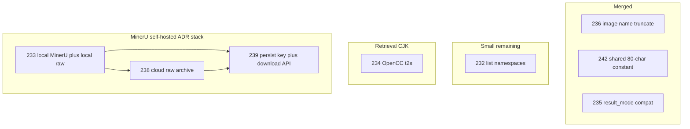

# First-contributor PR triage: gdccyuen

| Field | Value |
| --- | --- |
| Date | 2026-08-03 |
| Contributor | [`gdccyuen`](https://github.com/gdccyuen) (`FIRST_TIME_CONTRIBUTOR`) |
| Reviewer notes | Objective merge triage for open PRs; not an ADR |

## Background

These PRs primarily serve **self-hosted / multi-tenant proxy** deployments
(local MinerU, namespace discovery, Traditional Chinese retrieval, MinerU raw
audit archive). They are not required for the core SaaS cloud path unless a
specific product need is confirmed.

## Already merged

| PR | Title | Notes |
| --- | --- | --- |
| [#236](https://github.com/Ontos-AI/knowhere/pull/236) | Truncate markdown image name context | Real `OSError: File name too long` when `last_context` is huge. Cosmetic filename only. |
| [#242](https://github.com/Ontos-AI/knowhere/pull/242) | Share `MAX_ASSET_FILE_NAME_CHARS = 80` | Our follow-up: unify image truncate with table header naming (one constant in `file_utils`). |
| [#235](https://github.com/Ontos-AI/knowhere/pull/235) | Accept `result_mode` as compatibility extra | Dashboard still sends removed field; API now ignores it instead of `400`. |

Table filenames already went through `sanitize_table_name_from_header` (80-char
cap). Skipping deferred image rename when title sanitization yields nothing
keeps the **existing** on-disk file and row path — it does not delete the asset.

## Remaining open PRs

| PR | Theme | Recommendation | Why |
| --- | --- | --- | --- |
| [#232](https://github.com/Ontos-AI/knowhere/pull/232) | `GET /api/v1/documents/namespaces` | Merge if product needs it | Additive; contract tests; route declared before `/{document_id}`. |
| [#234](https://github.com/Ontos-AI/knowhere/pull/234) | OpenCC 繁→简 before jieba | Hold | New dependency; full 繁↔简 cross-match needs re-ingest; product priority unclear. |
| [#233](https://github.com/Ontos-AI/knowhere/pull/233) | Local MinerU `/file_parse` (+ local raw archive) | Fix then merge | Valuable for self-hosted; `MINERU_LOCAL_MODE` defaults `false`. Scope grew; docs/tests need alignment. |
| [#238](https://github.com/Ontos-AI/knowhere/pull/238) | Cloud MinerU raw ZIP → S3 | Hold | Stacked on #233. Archives whenever `job_id` is present — cloud storage cost needs a gate. |
| [#239](https://github.com/Ontos-AI/knowhere/pull/239) | Persist `mineru_raw_s3_key` + download API | Hold | Lights up after 233/238 sidecars. Alembic parent collides with #231; `String(512)` may be tight for multi-shard keys; `url` vs `urls` response shape. |

## Work map

Three themes:

1. **Compat / UX fixes** — filename length, dashboard field compat, namespace listing.
2. **CJK retrieval** — OpenCC Traditional→Simplified before jieba/BM25.
3. **MinerU self-hosted + raw audit archive** (ADR 0002 stack) — local mode → cloud archive → DB column + download API.

## Recommended sequence

1. Optionally merge [#232](https://github.com/Ontos-AI/knowhere/pull/232) when namespace discovery is needed.
2. Hold [#234](https://github.com/Ontos-AI/knowhere/pull/234) until product confirms 繁简 cross-match priority.
3. Treat MinerU as one stack: `#233 → #238 → #239`. Do not merge out of order. Before merging, decide cloud archive default/opt-in, fix alembic dual-head with #231, and harden #239 column width / response shape / existence checks.

## Known risks on the MinerU stack

### #233 Local MinerU

- Description historically drifted from implementation (ZIP flatten vs JSON
  `md_content` fallback). Prefer ZIP + flatten; JSON fallback skips raw archive.
- No `layout.json` on some paths → heading quality may degrade (MD parser already
  treats layout as optional).
- Default `MINERU_LOCAL_MODE=false` leaves cloud SaaS unchanged.

### #238 Cloud raw archive

- Depends on #233 (`job_id` / `mineru_raw_suffix` threading).
- Archives on every parse with a `job_id`; no dedicated feature flag called out.
- Storage cost: full MinerU ZIP often includes original PDF.

### #239 Persist + download

- Reader is defensive (missing sidecar → no key), so branch can land alone, but
  end-to-end needs 233/238 writers.
- Migration `down_revision = fbe1c2d3e4f5` conflicts with open [#231](https://github.com/Ontos-AI/knowhere/pull/231) (`fce1d2e3f4a5`).
- Multi-shard newline-joined keys may exceed `String(512)` (~10+ shards).
- Single key returns `url`, multi returns `urls` — awkward client contract.
- Unlike page-citation-source, no `verify_raw_exists` before signing URLs.

## Related local follow-ups already done

- Merged #236, then #242 to unify truncate length.
- Merged #235.
- Local `main` fast-forwarded; clean day branch `feat/wuchengke/2026-08-03`
  created from latest `main` per git-sync.
