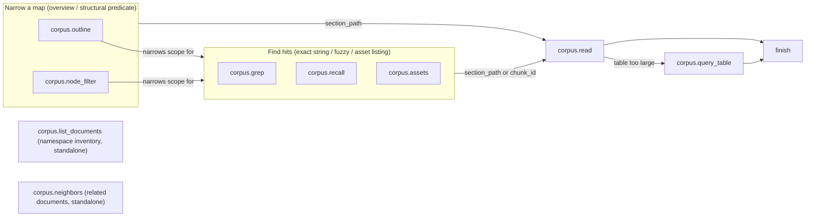

# Knowhere Corpus Schema (agent-facing)

Single source of truth for how an agent should understand and explore a
Knowhere corpus through the tools in this package. This text is intended to
be shipped verbatim as both the API `/mcp` server instructions and the
`agent_explore` system prompt — do not duplicate it elsewhere; edit here.

This describes the **published, DB-served corpus** (`documents`,
`document_sections`, `document_chunks`, `graph_nodes`, `graph_edges`) that
the tools below are designed to query. It is not the on-disk parse artifact schema
(`chunks.json` / `doc_nav.json` on disk use different join keys and a
different path separator) — that schema is for the parser pipeline, not for
this tool set.

---

## 1. Corpus model

```text
Namespace
  └─ Document        (document_id, source_file_name, parse_track)
       └─ Section     (section_id, parent_section_id, section_path, section_level, summary)
            └─ Chunk  (chunk_id, chunk_type, content, chunk_metadata)
```

- **Namespace**: the retrieval scope. One namespace can hold documents parsed
  by different tracks (see §2) — do not assume a namespace is uniform.
- **Document**: `document_id` is the stable identifier for every other tool
  call. `parse_track` is `page_memory` or `chunk` (see §2). Tool hit lines
  print `document_id` in parentheses after the filename (or alone, for
  `node_filter`); copy that value into later calls. Never pass
  `source_file_name` as `document_id`.
- **Section**: the navigable tree. `section_path` segments are joined with
  `" / "` (space-slash-space), one segment per heading/synthetic level.
- **Chunk**: the retrieval unit. `chunk_type` is `text`, `page`, `image`, or
  `table`. A section owns **at most one body chunk** (`text` or `page`) —
  but which sections get one is track-dependent (see §2). `image`/`table`
  chunks are **not** attached to the section they are conceptually "in" —
  see §3.

Document-level relationships (`related` edges, including entity-overlap
scoring) exist in a separate graph — see §4.

## 2. Body chunks: `text` vs `page`, and the `SAME-AS` pointer

A namespace can mix both tracks across documents (e.g. one PDF on the
`page_memory` track next to one DOCX/XLSX on the `chunk` track). Treat
`text` and `page` as the same *role* — both are a section's own body — but
they differ in shape, and in **which sections get a body chunk at all**:

- **`chunk` track** (`text` chunks, e.g. DOCX/XLSX/MD): a section owns a
  body chunk if it has any content of its own directly under its heading,
  before any child heading — this can be **any section, leaf or not**. Do
  not assume a section with children has no body text of its own; check
  whether it owns a chunk instead of assuming from tree position.
- **`page_memory` track** (`page` chunks, PDF): only **leaf** sections own a
  body chunk. Internal/structural sections never carry a `page` chunk
  themselves — their summaries aggregate from their leaf descendants.

A section owns **at most one** body chunk either way (verified against
real published data: a section with children and a section without both
had exactly 0 or 1, never more). So a "chunk" and "the section that owns
it" are the same unit, not two different granularities — there is no
separate finer-or-coarser level to choose between. The only structural
sections with no chunk of their own are `chunk`-track sections whose
entire content lives in their descendants.

For `page` chunks specifically: one leaf section's body may span one or
more physical pages. A page's text is stored **once**, under whichever leaf
is first in reading order to cover that page (the "owner"). Every other
leaf section that also covers that physical page has, in place of the
text, a literal marker:

  ```text
  [SAME-AS <owner_section_path> p<page_num>]
  ```

  This is a pointer, not a preview. If you need that page's actual text,
  resolve the marker by reading the owner section's chunk at that page
  number — do not treat the marker's absence of text as "this section has
  no content there." `page` chunks also carry `page_nums` (all physical
  pages they cover) and `page_assets` (rendered page-citation screenshots —
  these are references for citation, not separate `image` chunks).

  **Format trap**: `<owner_section_path>` inside the marker is written
  verbatim by the parser and stored as-is — it is the on-disk path
  (`"<source_file_name>/<Heading>/<Heading>/..."`, plain `/`, filename
  included), **not** the DB `section_path` you get back from
  `corpus.outline` / `corpus.node_filter` / `corpus.recall` (which is
  `" / "`-joined and excludes the filename). Do not string-match the
  marker directly against a DB `section_path`. Convert it first —
  `section_path_from_chunk_path()` in `search/lexical_text.py` already
  does this conversion and is the function to reuse when implementing
  marker resolution, not a new one.

## 3. Asset chunks: `image` / `table`, and `connect_to`

`image` and `table` chunks are **not children of the section they visually
belong to**. In the DB they are parked under their document's synthetic
`Root` section. The real association to a body section is the `connect_to`
list on the **body chunk**, not a location on the asset:

- `relation: "embeds"` — the body chunk that owns/embeds this asset inline.
- `relation: "related"` — another body chunk that shares the same source
  page as a page-track asset, without owning it (`same_as_owner` may name
  the owning section).

This link is **one-directional** (body → asset). There is no stored
asset → body back-link. `corpus.grep`, `corpus.recall`, and `corpus.assets`
resolve the host through that body link and print the hosting
`section_path` on the asset row. If no host is found, the row keeps
`Root` and is marked as having no host section. Use `corpus.assets`
`host_of` to list every host, rather than reading the asset's stored
path.

## 4. Document graph

Today the graph only has **document-level** nodes (`node_kind='document'`)
and undirected `related` edges between documents. Edge scoring prefers
**typed-entity overlap** between the two documents' aggregated `entities`
first; it only falls back to free-form TF-IDF keyword overlap when either
document lacks entities. Either way the edge carries which terms matched
(`properties.shared_entities` or `properties.shared_keywords`). There are
no section-level or entity-level graph *nodes* — an entity is not itself a
queryable node, and there is no entity-to-entity or entity-to-chunk edge,
only this document-to-document rollup. Use `neighbors` for "what else is
like this document" (and to see which shared terms justify that link), not
for anything finer-grained than a document pair.

## 5. Reserved / not yet available

- **Vector**: not available yet. `recall` today is path + content BM25.
  Exact-string lookup is `grep`.

## 6. Tools and how they work together

Every tool exists to find the `section_path`s (or asset `chunk_id`s) that
answer the query, then hand them to `corpus.read`. Names below are the
registered names (`corpus.outline`). MCP clients call those names as-is.
Exact call parameters live only in each tool's own schema/description
(ask for that, do not memorize names here) — this section is the
collaboration map: which tools narrow a search space, which produce hits,
and what to do with either kind of result.



**`corpus.outline` and `corpus.node_filter`** are the two map-narrowing
tools: both take one or more scope targets (a whole document, or a section
and everything under it) and return the *same* row shape — every
`section_path` in that scope, indented by level, with title/summary.
`corpus.outline` returns that unconditionally (the outline of what is
there); `corpus.node_filter` returns it only for the branches around a
structural predicate match (marked as a hit), still shown as full context
(ancestors + the entire matched subtree), not a bare list of matches. Use
a returned `section_path` to `corpus.read` a branch, or as the scope of a
`corpus.grep` / `corpus.recall` / `corpus.assets` call. Neither is
callable on a single leaf section with nothing under it; `corpus.read`
that directly instead.

**`corpus.grep`, `corpus.recall`, and `corpus.assets`** are the leaf-hit
tools: they search *within* a scope (the whole corpus, or one narrowed by
a prior `corpus.outline`/`corpus.node_filter` call) and return rows
pointing at specific sections/chunks, not a map. `corpus.grep` is exact
string (several terms are any-match / OR, rows stay in document order,
not relevance order); `corpus.recall` is fuzzy ranked search;
`corpus.assets` lists image/table chunks by type — on its own it is an
unfiltered listing with no way to judge relevance, so pair it with a
prior `corpus.grep`/`corpus.recall` hit (scope to that hit's section, or
reverse-resolve the hit's own asset references) rather than browsing
every asset in a document. Grep does not scan table-cell HTML — a table
only surfaces from `corpus.grep`/`corpus.recall` via its published
summary/keywords/caption, never by a literal cell value; find the table
via `corpus.assets` (or a hit on the surrounding body text) and use
`corpus.read`/`corpus.query_table` to inspect its cells. Every hit row
names a `document_id` plus either a `section_path` (body hits) or a
`chunk_id` (image/table hits). Image/table rows show the hosting
section, not the asset's stored `Root` path — read whichever address
applies with `corpus.read` next, then decide pick or no-pick for that
ref immediately from `corpus.read`'s own per-ref status.

**`corpus.read`** is where body content actually gets consumed: it accepts
many refs at once (mixing map-tool section_paths and leaf-hit chunk_ids),
and reports each ref's outcome separately so a failed ref does not hide a
successful one. A table `corpus.read` reports as too large points at
**`corpus.query_table`** for cell-level `SELECT`s over that same table.

**`corpus.list_documents`** and **`corpus.neighbors`** stand outside this
flow: `corpus.list_documents` is a namespace-wide inventory (only for an
explicit "list/inventory the documents" request, never a cold-start for a
content question); `corpus.neighbors` returns document-level related
edges (§4), unscoped by section.

General rule: narrow with `corpus.outline`/`corpus.node_filter` before
searching a large corpus; prefer `corpus.grep` over `corpus.recall` when
you know the exact string you are looking for, and fall back to
`corpus.recall` only for genuinely fuzzy questions.
